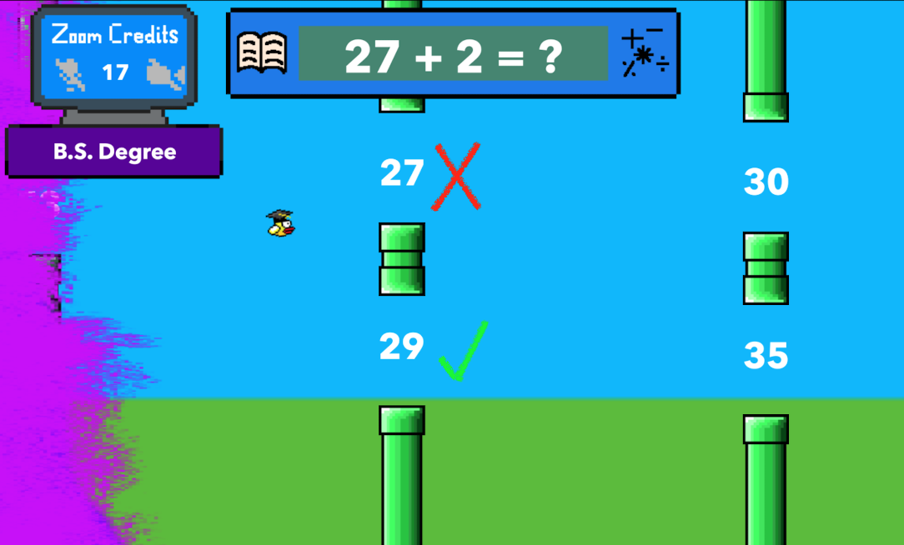
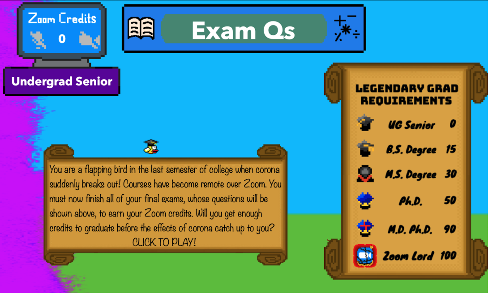
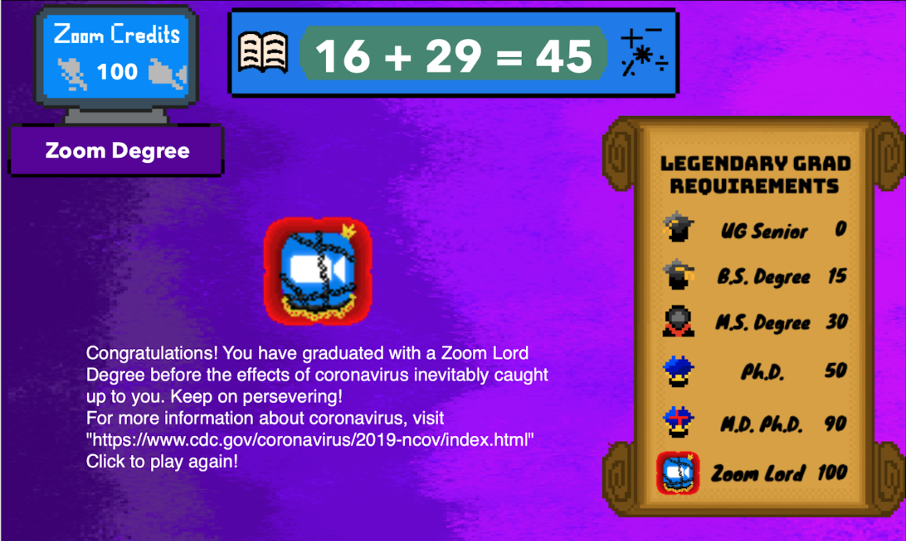

# **FlappyGrad**
FlappyGrad is a variation of FlappyBird where you solve math problems in addition to jumping through pipes. This project was started as a submission for the WWDC 2020 Student Challenge and as a way for me to learn more about Swift.

## **Inspiration**
My inspiration for this game is a combination of an old iOS app I created, my interest in learning Swift / entering the WWDC Challenge, and my personal situation due to COVID-19:
1. When I was first getting into coding around my high school junior year, I made a clone of FlappyBird similar to this where you had to do math to pass to the next pipe.
2. I am very interested in learning about Swift so that I can do more iOS / macOS coding. I created an app using Swift and WatchOS last winter 2020 called MinutesLeft: https://github.com/dan1510123/MinutesLeft
3. COVID-19 really changed the way that taking my college classes worked. With all remote classes / interaction hosted on Zoom, there is a boredom, laziness, and disappointment with not being able to learn as easily or hangout with my friends. Sometimes I needed a lot of motivation to do my work or apply for jobs. As such, I thought I'd project this situation onto the protagonist flapping bird. To earn his degree, he must get as many Zoom credits as possible.

## Storyline
You will play as a senior little bird who is in their last semester of college when corona breaks out. Now, classes are no longer in-person and must be made remote. As such, your courses will now be much different, so much that the credits you get from them are now called Zoom credits. You must now finish all of your final exams, represented as mere elementary math, so that you can rack up Zoom credits and graduate college with a degree. Luckily, you now have the ability to transfer Zoom credits easily to get higher level degrees. Will you manage to graduate before the effects of corona catch up to you (health, health preparation, laziness, poor organization)?

Below is a graphic of the number of Zoom credits you will need to graduate with each type of degree (remember that you started off as a last-semester senior):

## Rules
1. Click to jump
2. Do not hit the pipes (like normal flappy bird)
3. Fly through the slot with the correct answer to the math problem at the top

## Start screen
The intro screen:

## GameOver
Example of a gameover screen:

## Graphics
All assets in this game were created by me using **krita**
I wanted to honor the original flappy bird so I created all assets with pixelart ranging from 10x10 to 100x100 pixelart. Below is just one example of the assets I created:

